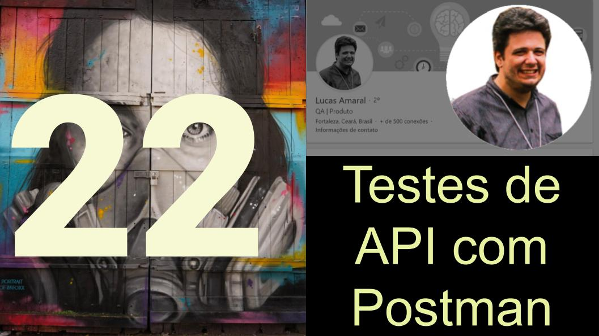

# qarentena-testesapi

## Material utilizado na Talk sobre testes de API utilizando Postman

- [Link do Video](https://www.youtube.com/watch?v=E2X6oztqxg0)
- [Apresentação](autom_testes_api_postman.pdf)

- [Linkedin](https://www.linkedin.com/in/lopesdoamaral/)

    - `$ npx serverest -p 3500 -t 3600 --nobearer`
